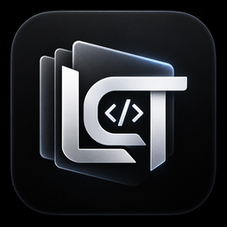
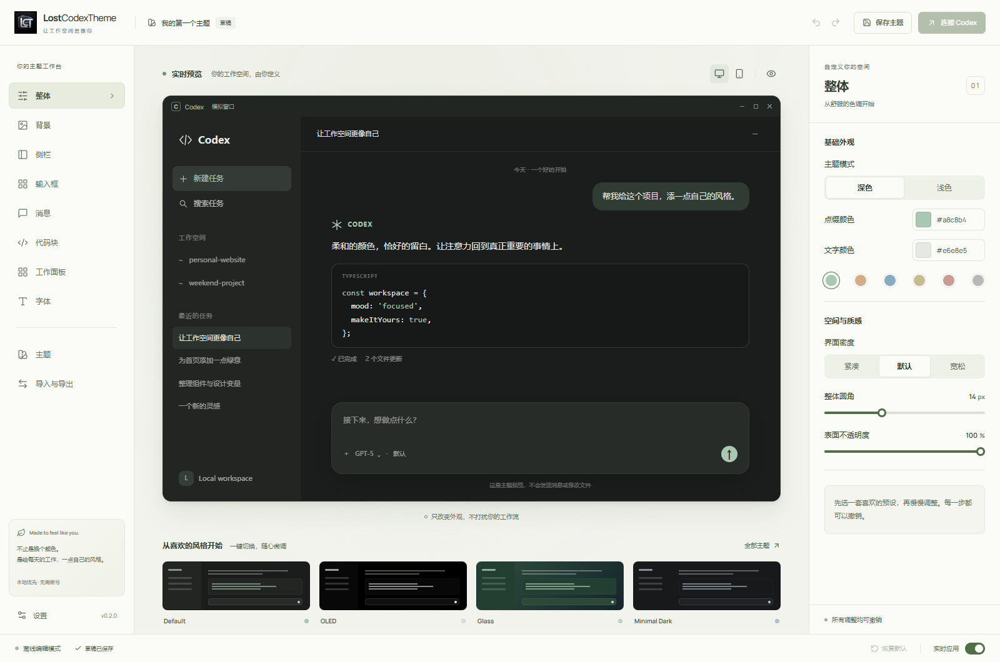

<p align="center">
  
</p>

<h1 align="center">LostCodexTheme</h1>

<p align="center">为 Codex 桌面端打造自己的工作空间。</p>

<p align="center">中文 · <a href="README.en.md">English</a></p>

<p align="center">
  <a href="https://github.com/xiaopenghuang/LostCodexTheme/releases/tag/v0.2.1"></a>
  
  <a href="LICENSE"></a>
  
</p>

LostCodexTheme 是一款面向 Windows 的本地优先可视化主题编辑器。无需手写 CSS，即可调整 Codex 桌面端的背景、侧栏、输入框、消息和工作面板，并在独立预览中查看效果。桌面程序使用 Tauri 2、Rust、React 和 TypeScript 构建，使用时无需安装 Node.js 或 Rust。

本项目为独立第三方工具，与 OpenAI 无隶属或背书关系。当前 v0.2.1 为公开预发布版，真实 Codex 窗口适配和安装、升级、卸载验收尚未完成，不代表对任何 Codex 版本的完整兼容承诺。

## 界面预览



图中为软件自带的模拟预览，不是真实 Codex 会话。编辑器当前以中文界面为主。

## 可以调整什么

**背景与配色。** 支持纯色、渐变及本地 PNG、JPEG、WebP 图片，单张图片最大 10 MiB。壁纸可延伸至侧栏和工作面板，透明度、模糊与颜色可以独立调整。用于显示的图片会按需压缩，保存和导出的原图保持不变。

**模块与文字。** 分别设置侧栏、输入框、用户与助手消息、代码块和字体；工作面板还可调整右侧文件区、Outputs/Sources 卡片及顶部工具按钮。原生窗口按钮不被替换，终端画面和嵌入网页内容不在换肤范围内。

**编辑与分享。** 内置八套预设，支持撤销、重做、草稿恢复、本地主题保存和主题包导入导出，也支持转换兼容的 Codex Dream Skin 主题包。浏览器开发模式仅提供编辑与模拟预览，不连接 Codex。

**后台运行。** 点击关闭按钮或按 Alt+F4 会隐藏到 Windows 系统托盘，换肤会话继续运行。点击托盘图标可重新打开，托盘菜单和设置页提供真正退出操作。

## 下载与使用

从 [GitHub Releases](https://github.com/xiaopenghuang/LostCodexTheme/releases) 下载 `LostCodexTheme_0.2.1_x64-setup.exe`。安装包面向 Windows x64，桌面界面需要 Microsoft Edge WebView2 Runtime。当前安装包未进行代码签名，同一发布页提供 SHA-256 校验文件。

安装后打开 LostCodexTheme，选择预设或上传背景图，调整模块样式并保存主题。准备连接前，请先保存 Codex 中的工作并自行完全退出 Codex，再使用编辑器右上角的连接入口启动主题会话。仅保存主题不会自动应用到已经打开的 Codex 窗口。

需要保持换肤时，关闭编辑器窗口即可，不要选择真正退出。**恢复默认或真正退出可能关闭由本软件启动的 Codex 会话，再请求正常启动，请先保存工作。** 强制结束换肤进程或程序崩溃也可能使其管理的 Codex 会话退出。

应用主题会同步 Codex 保存的原生深浅色外观，以匹配标题栏按钮；此偏好在恢复或退出后保留。软件不修改 Codex 安装文件、`app.asar` 或签名，而是通过受校验的本机回环 CDP 连接应用运行时样式。连接失败时请查看设置中的诊断信息，不要把预览效果视为连接成功。

## 兼容性与验证

适配观察与自动化样式夹具基于 Codex `26.908.4834.0`。自动化测试不等于真实窗口验收，Codex 更新后内部结构变化可能需要新的适配。侧栏实际宽度由 Codex 自带的分隔条控制，编辑器中的宽度只影响模拟预览。

v0.2.1 的验证范围、已知限制和修复内容见 [发布说明](docs/releases/0.2.1.md)。问题反馈请附上 Windows 版本、Codex 版本、复现步骤和已脱敏截图，提交至 [Issues](https://github.com/xiaopenghuang/LostCodexTheme/issues)，不要上传账号凭据或私人对话。

## 从源码运行

开发环境需要 Windows x64、Node.js 22 LTS、Rust stable 的 MSVC 工具链、Visual Studio C++ Build Tools 与 Windows SDK，以及 WebView2 Runtime。

```powershell
git clone https://github.com/xiaopenghuang/LostCodexTheme.git
cd LostCodexTheme
npm ci
npm run desktop:dev
```

仅开发编辑器界面时运行 `npm run dev`，构建安装包使用 `npm run desktop:build`。本地 `.tools` 工具链存在时脚本会优先使用它，否则使用系统 Rust；本仓库不包含工具链或依赖缓存。完整测试和构建说明见 [开发指南](docs/development.md)。

## 项目结构

`src/` 包含编辑器界面、主题模型、预览和主题包转换。`src-tauri/` 包含桌面入口、存储、进程管理与 Codex 适配。`tests/` 和 `scripts/` 分别保存回归测试与开发构建脚本。

`assets/branding/` 保存原始软件图标，`public/` 与 `src-tauri/icons/` 保存 Web 和桌面使用的图标。`docs/` 提供公开文档及截图。`licenses/` 和根目录的第三方声明保留依赖许可证与必要源码归档。构建产物、个人配置、本机审计记录和开发环境不会进入仓库；安装包仅放在 Releases。

## 许可证与致谢

项目采用 [MIT 许可证](LICENSE)。第三方依赖按各自许可证分发，详见 [第三方声明](THIRD_PARTY_NOTICES.md) 和 [依赖许可证汇总](THIRD_PARTY_DEPENDENCIES.txt)。

感谢 [Codex Dream Skin](https://github.com/Fei-Away/Codex-Dream-Skin) 提供的兼容性研究参考。相关来源与独立实现边界记录于 [参考资料](docs/references.md)。
